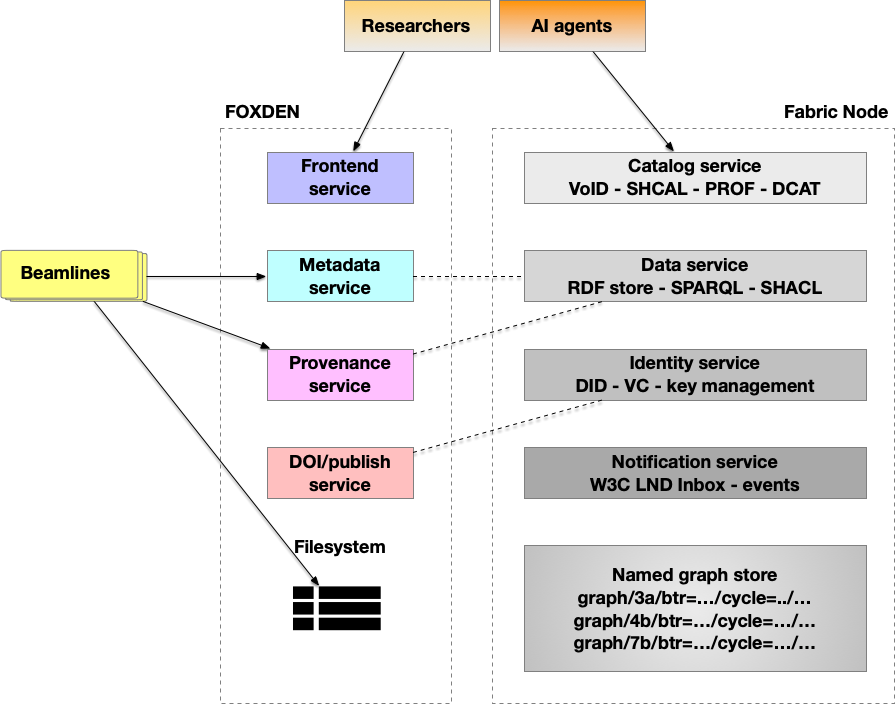

# FabricNode and FOXDEN
This document describe integration of FabricNode and FOXDEN.

FOXDEN is a *document store for domain metadata*. It knows that experiment `test-123-a` used beamline `3A`, detectors `dual_dexelas`, technique `HEDM`, PI `FirstLastName`, and so on. That knowledge lives in a JSON record validated against a beamline-specific schema. FOXDEN is excellent at answering "give me everything about this experiment" and "find experiments matching these field values." It was built by and for the CHESS user community — every beamline team fills in the schema fields they care about.

FabricNode is a *knowledge graph and semantic interoperability layer*. It doesn't replace FOXDEN; it consumes it. Once a FOXDEN record is ingested as RDF triples, the graph can answer questions that span records and services: "find all datasets from cycle 2026-1 where the technique includes HEDM and the beam energy was above 40 keV, and attach their provenance chains." FOXDEN can't do that without custom query logic for every new combination. SPARQL can do it with one query because all the facts share a common representation.

Here is pictorial representations of two systems:


**How provenance fits in**

FOXDEN's provenance service captures *who did what* in the beamline context — which user submitted the BTR, which staff scientist ran the experiment, which processing steps were applied. In the FabricNode, that provenance gets converted to W3C PROV-O triples (`prov:wasGeneratedBy`, `prov:wasAssociatedWith`, `prov:used`) and stored in the same named graph as the metadata. This means a SPARQL query can simultaneously ask about a dataset's physics *and* its chain of custody — something impossible when provenance and metadata live in separate JSON documents.

**How the ingest endpoint ties it together**

The `POST /beamlines/{beamline}/datasets/{did}/foxden/ingest` endpoint is the deliberate coupling point. Rather than running a continuous sync, you call it when you want the graph to reflect the current FOXDEN state — after a dataset is finalised, after provenance is recorded, after a DOI is minted. This keeps the two systems loosely coupled: FOXDEN doesn't need to know FabricNode exists, and FabricNode doesn't poll FOXDEN continuously. When you're ready for the dataset to be discoverable and queryable as a graph, you trigger the ingest.

---

**What is RDF and why convert FOXDEN records to triples?**

RDF stands for Resource Description Framework. Its core idea is that every fact is expressed as a three-part statement:

```
subject  →  predicate  →  object
```

Where subject and predicate are IRIs (named things) and object is either an IRI or a literal value. A concrete example from a FOXDEN record:

```
http://chess.cornell.edu/dataset/beamline=3a/btr=test-123-a/...
  → http://purl.org/dc/terms/creator
  → "FirstLastName"
```

Or in shorthand Turtle notation:
```turtle
<chess:dataset/3a/...>  dct:creator  "FirstLastName" .
<chess:dataset/3a/...>  chess:cycle  "2026-1" .
<chess:dataset/3a/...>  chess:beamEnergy  "41.991"^^xsd:decimal .
```

The reason to convert FOXDEN's JSON into triples is that JSON is a document — it describes one thing in isolation. RDF is a *graph* — it describes relationships between things across documents. Once your FOXDEN records are triples you can ask questions that span records: "find all datasets from cycle 2026-1 where beam energy was above 40 keV and the technique included tomography" — a single SPARQL query across the whole graph, without writing custom JOIN logic.

---

**Why ingest at all?**

The ingest endpoint (`POST /foxden/ingest`) pulls a FOXDEN record, converts it to triples, and writes those triples into the local named graph. You need this because the two systems have different jobs and different query interfaces. FOXDEN answers "tell me about this metadata record." The knowledge graph answers "find me all datasets connected to this sample, this technique, this provenance chain." Ingestion is the bridge — it copies the facts from FOXDEN's document store into a form the graph can reason over. Without it, the graph is empty of domain knowledge and can only answer questions about triples you've manually inserted.

---

### Glossary:

* **VoID**: Vocabulary for describing RDF datasets and their access points (e.g., SPARQL endpoints) for discovery and federation.
* **PROF**: W3C Profiles Vocabulary used to describe and relate profiles, constraints, and representations of a resource.
* **SHACL**: A W3C standard for validating RDF data against a set of constraints (shapes).
* **SPARQL**: A W3C query language and protocol for retrieving and manipulating RDF data.
* **VC (Verifiable Credential)**: A tamper-evident digital credential whose authenticity can be cryptographically verified.
* **DID (Dataset Identifier)**: A unique identifier used to reference a specific dataset within a system or catalog.
* **W3C LDN (Linked Data Notifications)**: A protocol for sending and receiving notifications between web resources using Linked Data principles.

- **IRI** stands for Internationalized Resource Identifier — essentially a URL that names a thing rather than necessarily locating it. In RDF, a *named graph* is a container that groups a set of triples together under one IRI so you can talk about that whole set as a unit, query just that subset, or track where triples came from.

In the FabricNode store, every dataset gets its own named graph:

```
http://chess.cornell.edu/graph/3a/btr=test-123-a/cycle=2026-1/sample_name=PAT-...
```

That IRI is the graph's identity. When you query `/beamlines/3a/sparql` the service restricts results to graphs whose IRI starts with `http://chess.cornell.edu/graph/3a/` — that's how beamline scoping works. Without named graphs you'd have one undifferentiated pile of triples with no way to say "show me only what belongs to this dataset."

